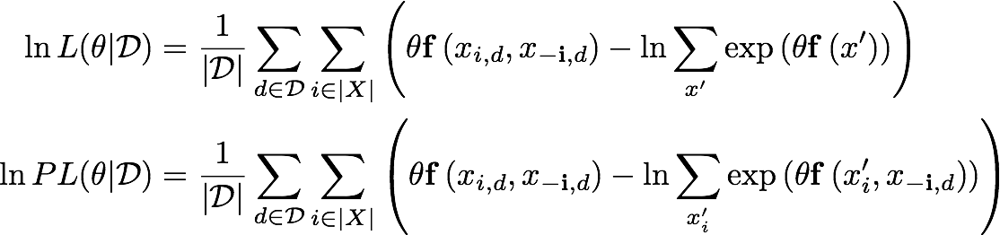

Markov network estimation via pseudo-likelihood
==============

This project implements parameter estimation for log-linear Markov networks. It supports maximum pseudo-likelihood estimation for  continuous, discrete, and hybrid systems.

Background
--------------
These models are specified by a set of weighted *potentials*. Each potential is a non-negative function of one or more variables in the model. In the log-linear formulation, the unnormalized log-probability of a given variable configuration is a weighted linear combination of the values of the potential functions at the candidate configuration. The (convex) learning task is to assign weights to the potential functions.

Maximum likelihood parameter estimation for a log-linear Markov network requires computing a sum over all combinations of variables in the system (first equation below). This quickly becomes intractable as the number of variables grows. Maximum likelihood estimation is especially difficult when working with continuous variables, as these nested sums become multi-dimensional integrals.

Pseudo-likelihood (second equation below) is an approximation of the likelihood function which only requires computing *local* partition function for each variable, and has been shown to have strong empirical performance. Pseudo-likelihood is much easier to apply to models with continuous variables, as it involves only univariate integrals.



Installation
-------------

Download the repository, and install with:

```
python setup.py install
```

Requires numpy.

Usage
-------------

Import the package and structure your data as a dictionary mapping variable name to a numpy array of samples. Here, I'll generate some toy data.

```python
from plmrf import *
import numpy as np

np.random.seed(100)
x = np.random.binomial(1, 0.5, size=100)
x = (x-1) + x # transform to -1/1
y = np.random.normal(loc=x)
data = {"x" : x, "y" : y}
```
Create a collection of `VariableDef` objects. For discrete variables, supply the `ddomain` argument as a list of possible values. For continuous variables, supply an array of samples which will be used to inform numerical integration procedures. The order of variables in this list is unimportant.

```python
variable_defs = [VariableDef("x", ddomain=[-1, 1]),
                 VariableDef("y", samples=y)]
```

Specify a list of potential functions and the variables participating in them. In this case, I'm using a Gaussian kernels with bandwidth estimated from the data with a rule-of-thumb method. For univariate data, it's necessary need to specify the peak of this kernel. I expect the first potential to be most informative, so it should have a larger weight once the network is fit.

```python
potentials = [GaussianPotential(["x", "y"], samples=data),
              GaussianPotential(["y"], samples=data, location=0)]
```

Finally, create an instance of `LogLinearMarkovNetwork` and fit the parameters using the default method of maximum pseudo-likelihood estimation.

```python
network = LogLinearMarkovNetwork(potentials, variable_defs)
result = network.fit(data)
print(result.x)
# [ 2.67177328  0.33832092]
```
Internally, `plmrf` uses `scipy`'s optimization library, and the result is an instance of `scipy.optimize.OptimizeResult`. Once `fit` has been called, the learned parameters are stored internally in the network, and you can perform inference. `gibbs_sample` takes a dictionary of numpy arrays as an argument and samples the next state for each entry in the array. In this way, you can run multiple Gibbs chains with a single function call. `unnormalized_prob` returns a term that is proportional to the joint probability, and can be used in MCMC procedures, though `plmrf` does not include a sampler.

```python
new_data = {"x" : np.array([1, -1]), "y" : np.array([-10, 0])}
print(network.gibbs_sample(new_data))
# {'y': array([ 0.36314832, -2.45130511]), 'x': array([ 1, -1])}
print(network.unnormalized_prob(new_data))
# [ 1.00056874  4.14611332]
```
The first sample in `new_data` is highly unlikely given the generative process, and has a smaller probability density as a result.

Check out the `examples/` folder for other basic usage demos.
